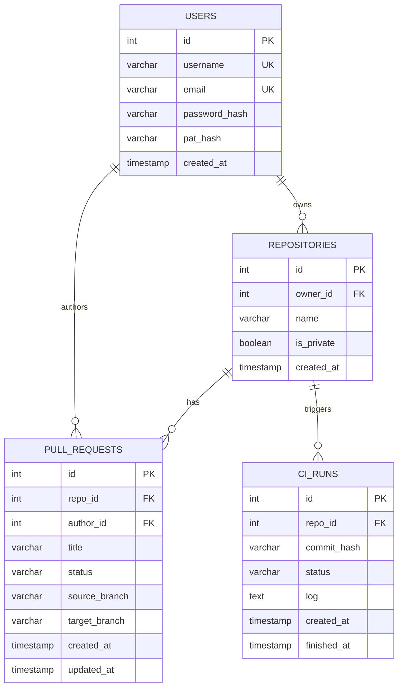
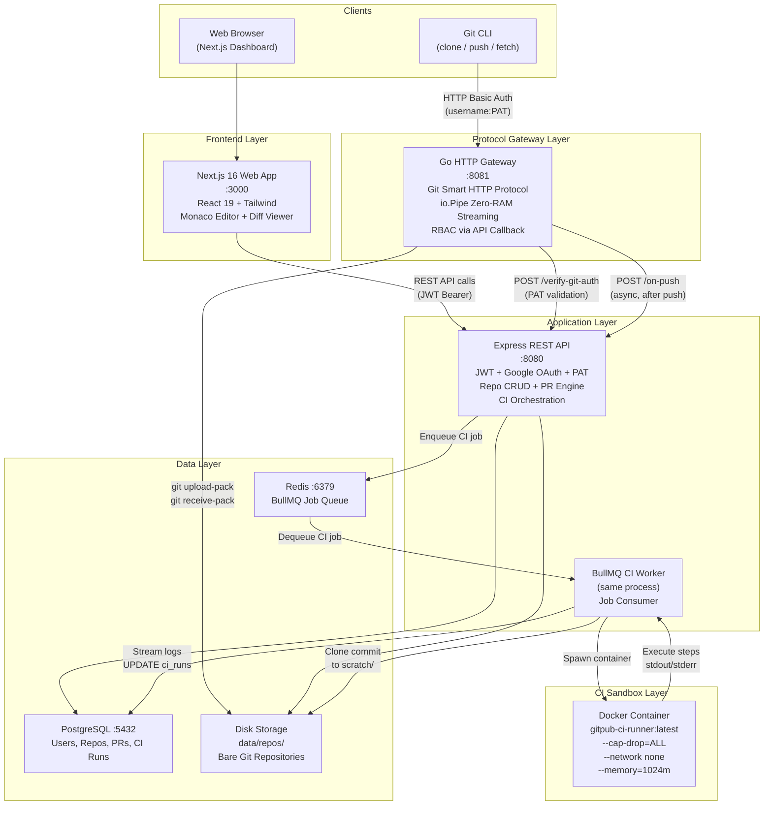
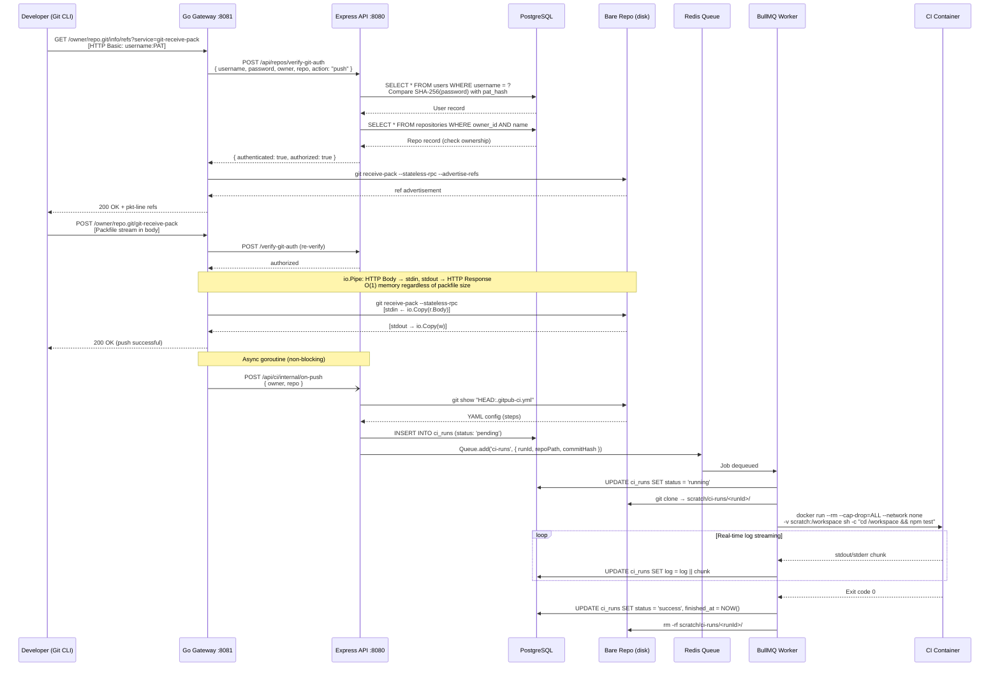
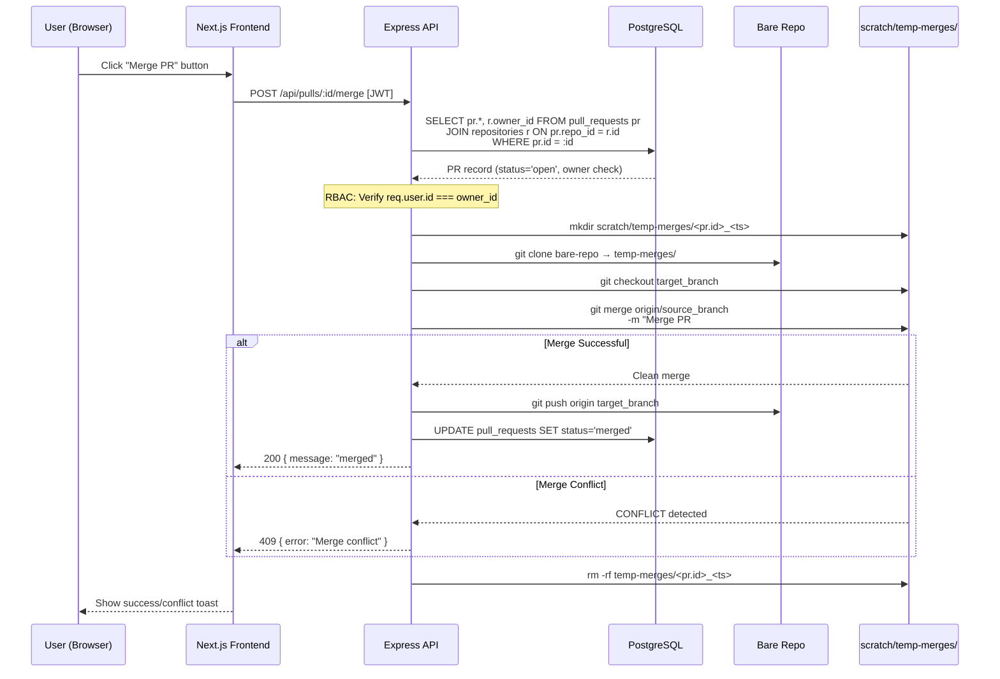
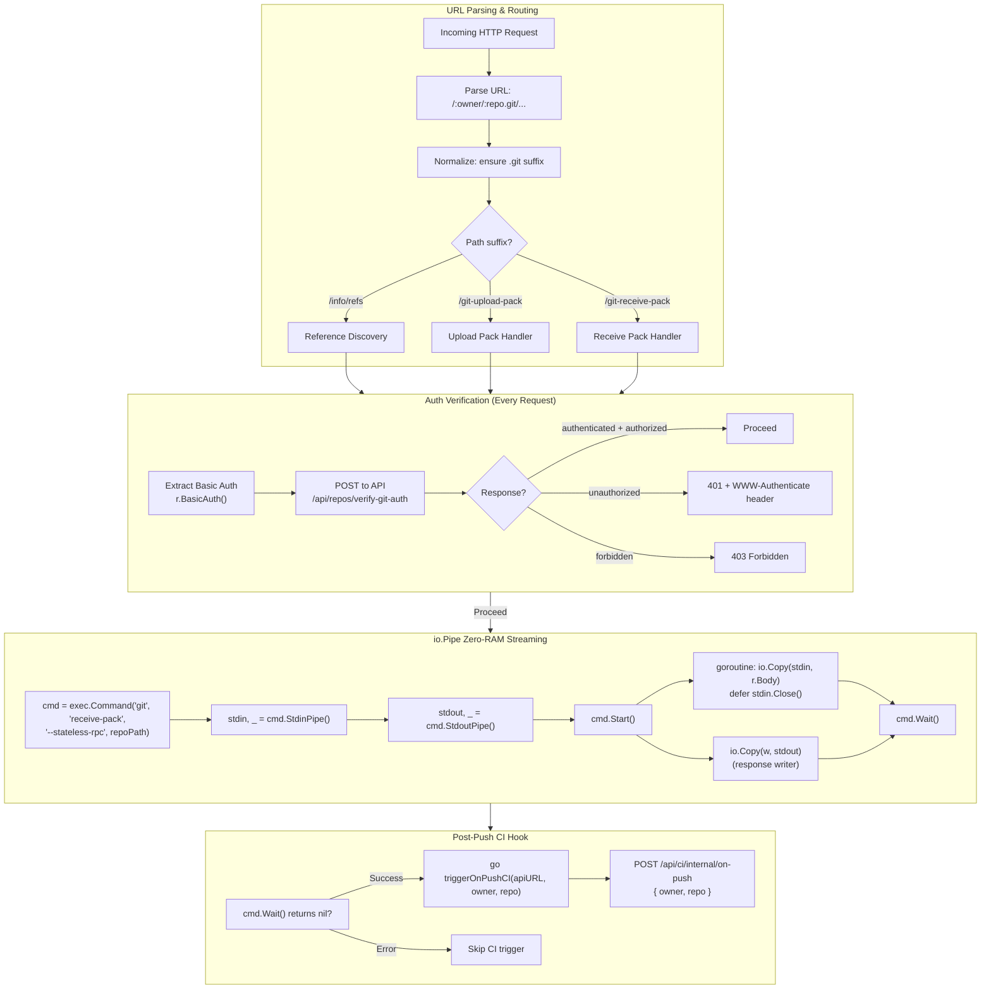
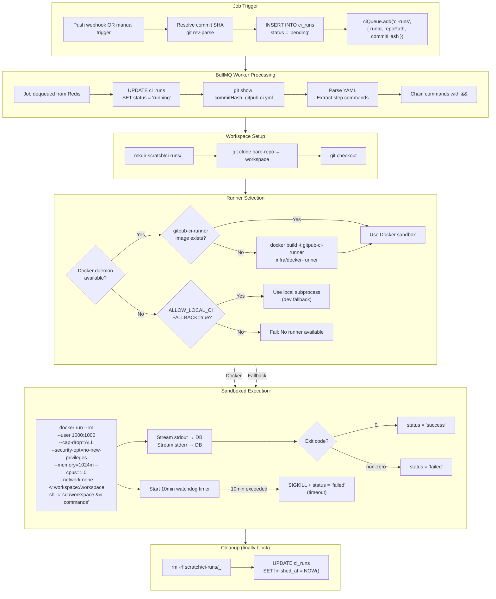
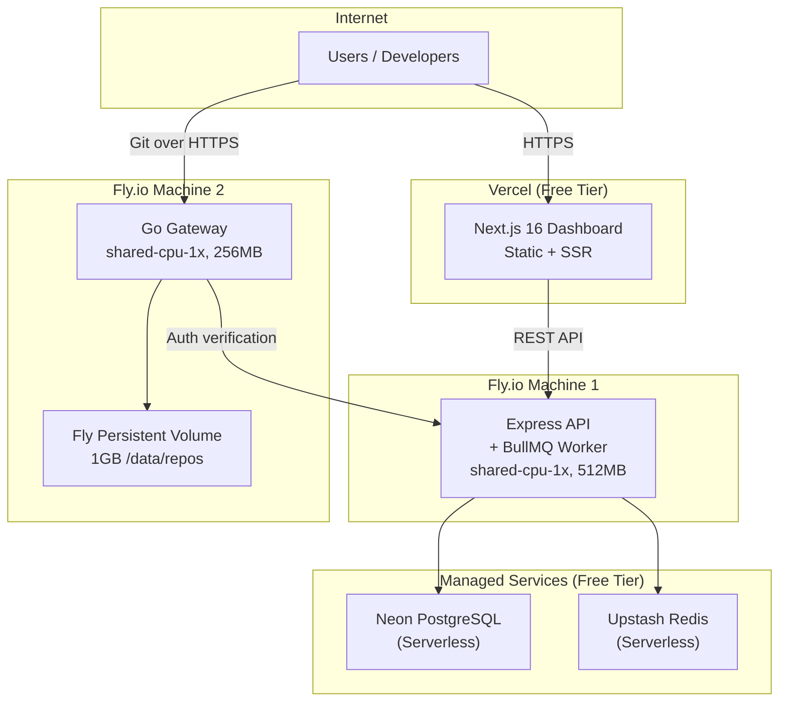

# GitPub — System Design (Interview-Ready)

> A self-hosted Git VCS & CI Sandbox Platform built with microservice architecture.

---

## 1. Project Description

**GitPub** is a modern, self-hosted **Git version control system** and **CI/CD sandbox platform** — essentially a simplified, self-hostable alternative to GitHub + GitHub Actions.

### What does it do?

| Capability | Description |
|---|---|
| **Git Hosting** | Host Git repositories on your own server. Users can `clone`, `push`, `fetch` using standard Git CLI over HTTP Smart Protocol. |
| **Authentication** | Multi-strategy auth: email/password (Argon2id), Google OAuth 2.0, and Personal Access Tokens (PAT) for Git CLI. |
| **Repository Management** | Create public/private repos, browse file trees, view file contents — all via a web dashboard. |
| **Pull Requests** | Open PRs between branches, view unified diffs, and merge with conflict detection. |
| **CI/CD Pipelines** | Automatically build & test code on every `git push` inside hardened Docker sandbox containers. Live-stream logs to the UI. |
| **Web Dashboard** | Next.js Bento Grid UI with Monaco Editor, diff viewer, and real-time CI console. |

### Why is this interesting from a system design perspective?

- **Streaming I/O**: Git packfiles can be 50MB–1GB+. The system uses `io.Pipe` for zero-RAM buffering.
- **Multi-language microservices**: Go gateway (performance), Node.js API (productivity), Next.js frontend.
- **Sandboxed execution**: Running untrusted user code safely with Linux capability dropping, network isolation, memory limits.
- **Event-driven architecture**: Push events → message queue → async CI workers.

---

## 2. Functional Requirements (FR)

| ID | Requirement | Category |
|---|---|---|
| **FR-1** | Users can register, login (email/password), and authenticate via Google OAuth | Auth |
| **FR-2** | Users can generate Personal Access Tokens (PAT) for Git CLI authentication | Auth |
| **FR-3** | Users can create public/private Git repositories | Repo Management |
| **FR-4** | Users can clone, push, and fetch repositories using standard Git CLI | Git Protocol |
| **FR-5** | Users can browse repository file trees and view file contents via web UI | Repo Browsing |
| **FR-6** | Users can open Pull Requests between branches | PR Engine |
| **FR-7** | Users can view unified diffs for Pull Requests | PR Engine |
| **FR-8** | Repository owners can merge Pull Requests (with conflict detection) | PR Engine |
| **FR-9** | CI pipelines are automatically triggered on `git push` | CI/CD |
| **FR-10** | Users can manually trigger CI runs on any branch/commit | CI/CD |
| **FR-11** | CI logs are streamed in real-time to the database and UI | CI/CD |
| **FR-12** | CI runs execute inside hardened, sandboxed Docker containers | CI/CD |

---

## 3. Non-Functional Requirements (NFR)

### 3.1 Scalability

| Aspect | Current Design | Scale Strategy |
|---|---|---|
| **Read-heavy traffic** (clones/fetches) | Single Go gateway | Horizontal scaling: stateless Go gateway behind a load balancer. Repos on shared NFS/EFS volume. |
| **Write traffic** (pushes) | Single writer | Shard repos by owner hash across multiple storage nodes. Use consistent hashing. |
| **CI job throughput** | Single BullMQ worker | Scale workers horizontally — each worker is stateless and pulls jobs from Redis queue. Add more Fly.io machines. |
| **Database** | Single PostgreSQL | Read replicas for dashboard queries. Vertical scaling for writes. Partition `ci_runs` by `created_at` for log archival. |

### 3.2 CAP Theorem Analysis

```
                    Consistency
                       /\
                      /  \
                     /    \
                    / GitPub\
                   /  chooses \
                  /    CP      \
                 /______________\
          Availability      Partition Tolerance
```

| Property | GitPub's Position |
|---|---|
| **Consistency (C)** | ✅ **Chosen**. Git operations MUST be linearizable — a push must be fully committed before the next push reads refs. PostgreSQL provides ACID guarantees for metadata. |
| **Availability (A)** | ⚠️ **Best-effort**. During a network partition, the system prefers returning errors over serving stale data (e.g., a half-pushed packfile). |
| **Partition Tolerance (P)** | ✅ **Required**. Microservice architecture means network partitions between Gateway ↔ API ↔ DB are inevitable in production. |

> **Verdict: CP system.** Git is inherently a CP system — refs must be consistent. We sacrifice availability during partitions rather than risk data corruption.

### 3.3 Latency

| Operation | Target Latency | How Achieved |
|---|---|---|
| **Git clone (small repo)** | < 500ms | `io.Pipe` zero-copy streaming, no buffering. Go's efficient goroutine-per-connection model. |
| **Git clone (large repo, 500MB)** | Stream-dependent | O(1) memory via `io.Pipe`. Latency = network bandwidth, not server memory. |
| **API CRUD operations** | < 100ms | PostgreSQL connection pooling (`pg.Pool`), indexed queries. |
| **CI job start** | < 5s | BullMQ near-instant dequeue. Docker container cold start ~2-3s. |
| **CI log polling** | 5s intervals | Frontend polls `/api/ci/:id` every 5 seconds. Could upgrade to WebSocket/SSE. |
| **PR diff computation** | < 2s | Native `git diff` on bare repo — no clone needed. |

### 3.4 Reliability & Fault Tolerance

| Concern | Mitigation |
|---|---|
| **CI runner crash** | 10-minute watchdog timeout with `SIGKILL`. Temp workspace cleaned in `finally` block. |
| **Docker unavailable** | Graceful fallback to local subprocess execution (dev mode only). |
| **Database failure** | Health check endpoint (`/api/health`) pings DB. Container orchestrator restarts on failure. |
| **Orphaned containers** | `--rm` flag auto-destroys containers on exit. |

### 3.5 Security

| Layer | Mechanism |
|---|---|
| **Password storage** | Argon2id (memory-hard, side-channel resistant) |
| **Token storage** | SHA-256 hashed PATs — plaintext never stored |
| **JWT** | HMAC-SHA256, 24h expiry |
| **CI Sandbox** | `--cap-drop=ALL`, `--no-new-privileges`, `--network none`, `--memory=1024m`, `--cpus=1.0`, non-root user |
| **RBAC** | Owner-only push, owner-only merge, private repo access control |

---

## 4. Core Entities



### Entity Relationships Explained

| Relationship | Cardinality | Cascade |
|---|---|---|
| User → Repository | 1 : N | `ON DELETE CASCADE` — deleting a user deletes all their repos |
| User → Pull Request | 1 : N | `ON DELETE CASCADE` — deleting a user deletes their PRs |
| Repository → Pull Request | 1 : N | `ON DELETE CASCADE` — deleting a repo deletes its PRs |
| Repository → CI Run | 1 : N | `ON DELETE CASCADE` — deleting a repo deletes CI history |

### Status Enums

| Entity | Field | Possible Values |
|---|---|---|
| `pull_requests` | `status` | `open` → `merged` |
| `ci_runs` | `status` | `pending` → `running` → `success` \| `failed` |

---

## 5. API Design (Mapped 1:1 to Functional Requirements)

### 5.1 Authentication APIs → FR-1, FR-2

| Method | Endpoint | Auth | Maps to | Description |
|---|---|---|---|---|
| `POST` | `/api/auth/register` | None | FR-1 | Register with `{ username, email, password }`. Argon2id hash. Returns user object. |
| `POST` | `/api/auth/login` | None | FR-1 | Login with `{ email, password }`. Returns 24h JWT `{ token }`. |
| `POST` | `/api/auth/google` | None | FR-1 | Google OAuth. Sends `{ credential }` (ID token). Auto-creates user if new. Returns JWT. |
| `POST` | `/api/auth/pat` | JWT | FR-2 | Generate PAT `gp_pat_<48hex>`. SHA-256 stored. Plaintext returned once. |

### 5.2 Repository APIs → FR-3, FR-5

| Method | Endpoint | Auth | Maps to | Description |
|---|---|---|---|---|
| `POST` | `/api/repos` | JWT | FR-3 | Create repo `{ name, is_private }`. Runs `git init --bare`. Returns clone URL. |
| `GET` | `/api/repos` | JWT | FR-3 | List user's repos + all public repos. Ordered by `created_at DESC`. |
| `GET` | `/api/repos/:owner/:repo/files` | JWT | FR-5 | Browse file tree. Runs `git ls-tree -r --name-only HEAD`. |
| `GET` | `/api/repos/:owner/:repo/file-content` | JWT | FR-5 | View file. Runs `git show "HEAD:<path>"`. Query param: `?path=...`. |

### 5.3 Git Protocol APIs → FR-4 (Handled by Go Gateway)

| Method | Endpoint | Auth | Maps to | Description |
|---|---|---|---|---|
| `GET` | `/:owner/:repo.git/info/refs?service=git-upload-pack` | Basic | FR-4 | Fetch/clone ref discovery |
| `GET` | `/:owner/:repo.git/info/refs?service=git-receive-pack` | Basic | FR-4 | Push ref discovery |
| `POST` | `/:owner/:repo.git/git-upload-pack` | Basic | FR-4 | Clone/fetch packfile stream |
| `POST` | `/:owner/:repo.git/git-receive-pack` | Basic | FR-4 | Push packfile stream + trigger CI |

### 5.4 Internal Verification API (Gateway → API)

| Method | Endpoint | Auth | Description |
|---|---|---|---|
| `POST` | `/api/repos/verify-git-auth` | Internal | Gateway verifies PAT credentials. Returns `{ authenticated, authorized }`. |

### 5.5 Pull Request APIs → FR-6, FR-7, FR-8

| Method | Endpoint | Auth | Maps to | Description |
|---|---|---|---|---|
| `POST` | `/api/pulls` | JWT | FR-6 | Create PR `{ repoId, title, sourceBranch, targetBranch }`. |
| `GET` | `/api/pulls?repoId=X` | JWT | FR-6 | List PRs for a repository with author names. |
| `GET` | `/api/pulls/:id/diff` | JWT | FR-7 | Compute diff via `git diff "target...source"` on bare repo. |
| `POST` | `/api/pulls/:id/merge` | JWT | FR-8 | Merge PR: temp clone → merge → push back. Detects conflicts (409). Owner-only. |

### 5.6 CI/CD APIs → FR-9, FR-10, FR-11

| Method | Endpoint | Auth | Maps to | Description |
|---|---|---|---|---|
| `POST` | `/api/ci/internal/on-push` | Internal | FR-9 | Auto-trigger CI on push. Reads `.gitpub-ci.yml` from commit. |
| `POST` | `/api/ci/trigger` | JWT | FR-10 | Manual CI trigger `{ repoId, branchOrCommit }`. |
| `GET` | `/api/ci?repoId=X` | JWT | FR-11 | List all CI runs for a repo. |
| `GET` | `/api/ci/:id` | JWT | FR-11 | Get single CI run with full log output. |

### 5.7 Health Check

| Method | Endpoint | Auth | Description |
|---|---|---|---|
| `GET` | `/api/health` | None | Pings PostgreSQL. Returns `{ status: 'healthy' }`. |

---

## 6. High-Level Design (HLD)

### 6.1 System Architecture



### 6.2 Request Flow: `git push` (End-to-End)

This is the most complex flow in the system — covering protocol handling, auth, streaming, and async CI triggering:



### 6.3 Request Flow: Pull Request Merge



---

## 7. Low-Level Design (LLD) Deep Dive

### 7.1 Authentication System — LLD

```mermaid
flowchart TD
    subgraph Registration["Registration Flow"]
        R1["POST /api/auth/register<br/>{ username, email, password }"]
        R2["Validate input<br/>(regex, required fields)"]
        R3["Hash password<br/>argon2.hash(password)"]
        R4["INSERT INTO users<br/>(username, email, password_hash)"]
        R5["Return 201<br/>{ user: { id, username, email } }"]
        R6["Return 409<br/>Duplicate username/email"]
        
        R1 --> R2 --> R3 --> R4
        R4 -->|Success| R5
        R4 -->|Unique violation| R6
    end

    subgraph Login["Login Flow"]
        L1["POST /api/auth/login<br/>{ email, password }"]
        L2["SELECT * FROM users<br/>WHERE email = ?"]
        L3["argon2.verify<br/>(password_hash, password)"]
        L4["jwt.sign({ id, username, email },<br/>JWT_SECRET, { expiresIn: '24h' })"]
        L5["Return { token, user }"]
        
        L1 --> L2 --> L3 -->|Match| L4 --> L5
        L3 -->|No match| L6["Return 401"]
    end

    subgraph PAT["PAT Generation Flow"]
        P1["POST /api/auth/pat<br/>[JWT Required]"]
        P2["rawPat = 'gp_pat_' +<br/>crypto.randomBytes(24).hex()"]
        P3["hash = SHA-256(rawPat)"]
        P4["UPDATE users<br/>SET pat_hash = hash<br/>WHERE id = user.id"]
        P5["Return { token: rawPat }<br/>(shown once, never stored)"]
        
        P1 --> P2 --> P3 --> P4 --> P5
    end

    subgraph Google["Google OAuth Flow"]
        G1["POST /api/auth/google<br/>{ credential: ID_TOKEN }"]
        G2["OAuth2Client.verifyIdToken<br/>({ idToken, audience: CLIENT_ID })"]
        G3{"User exists<br/>by email?"}
        G4["SELECT * FROM users<br/>WHERE email = ?"]
        G5["Auto-create user<br/>sanitized username<br/>random 32-byte password"]
        G6["jwt.sign() → 24h token"]
        
        G1 --> G2 --> G3
        G3 -->|Yes| G4 --> G6
        G3 -->|No| G5 --> G6
    end
```



### 7.2 Git Protocol Gateway — LLD



### 7.3 CI Pipeline Execution — LLD



### 7.4 Pull Request Diff & Merge — LLD

```mermaid
flowchart TD
    subgraph DiffEngine["Diff Engine"]
        DE1["GET /api/pulls/:id/diff"]
        DE2["Fetch PR from DB<br/>(source_branch, target_branch)"]
        DE3["Resolve bare repo path<br/>data/repos/owner/repo.git"]
        DE4["Execute: git diff<br/>'target_branch...source_branch'<br/>(triple-dot = merge-base diff)"]
        DE5["Return unified diff string"]
        
        DE1 --> DE2 --> DE3 --> DE4 --> DE5
    end

    subgraph MergeEngine["Merge Engine"]
        ME1["POST /api/pulls/:id/merge"]
        ME2["Fetch PR from DB"]
        ME3{"PR status<br/>== 'open'?"}
        ME4{"req.user.id<br/>== owner_id?"}
        ME5["Create temp workspace<br/>scratch/temp-merges/"]
        ME6["git clone bare-repo → temp"]
        ME7["git checkout target_branch"]
        ME8["git merge origin/source_branch<br/>-m 'Merge PR #id...'"]
        ME9{"Conflict?"}
        ME10["git push origin target_branch"]
        ME11["UPDATE PR status = 'merged'"]
        ME12["Return 409 Conflict"]
        ME13["Return 400 'already merged'"]
        ME14["Return 403 Forbidden"]
        ME15["Cleanup: rm -rf temp"]
        
        ME1 --> ME2 --> ME3
        ME3 -->|No| ME13
        ME3 -->|Yes| ME4
        ME4 -->|No| ME14
        ME4 -->|Yes| ME5 --> ME6 --> ME7 --> ME8 --> ME9
        ME9 -->|No| ME10 --> ME11
        ME9 -->|Yes| ME12
        ME11 --> ME15
        ME12 --> ME15
    end
```



> [!NOTE]
> **Why triple-dot diff?** `git diff A...B` computes the diff from the merge-base of A and B to B. This shows only the changes introduced in the source branch, ignoring commits already in the target — exactly what a PR review needs.

> [!NOTE]
> **Why clone for merge?** Bare repositories have no working tree or index, so `git merge` cannot run directly on them. The system creates an ephemeral scratch clone, performs the merge in a proper working tree, then pushes the result back to the bare repo.

---

## 8. Database Access Patterns & Indexing Strategy

| Query Pattern | Table | Suggested Index | Frequency |
|---|---|---|---|
| Login by email | `users` | `UNIQUE(email)` ✅ | High |
| PAT validation by username | `users` | `UNIQUE(username)` ✅ | High (every git op) |
| List repos by owner | `repositories` | `(owner_id, created_at DESC)` | Medium |
| Find repo by owner + name | `repositories` | `UNIQUE(owner_id, name)` ✅ | High (every git op) |
| List PRs by repo | `pull_requests` | `(repo_id, created_at DESC)` | Medium |
| List CI runs by repo | `ci_runs` | `(repo_id, created_at DESC)` | High (polling) |
| Append CI log | `ci_runs` | PK lookup by `id` ✅ | Very High (streaming) |

---

## 9. Scaling Deep Dive — What Would Change at 10x / 100x Scale?

```mermaid
flowchart LR
    subgraph Current["Current: Single-Node"]
        A1["1 Go Gateway"]
        A2["1 Express API"]
        A3["1 BullMQ Worker"]
        A4["1 PostgreSQL"]
        A5["1 Redis"]
        A6["Local Disk"]
    end

    subgraph Scale10x["10x Scale"]
        B1["3 Go Gateways<br/>(behind LB)"]
        B2["3 Express APIs<br/>(behind LB)"]
        B3["5 BullMQ Workers"]
        B4["PostgreSQL +<br/>2 Read Replicas"]
        B5["Redis Cluster<br/>(3 nodes)"]
        B6["Shared NFS/EFS<br/>Volume"]
    end

    subgraph Scale100x["100x Scale"]
        C1["Go Gateways<br/>(auto-scaled K8s pods)"]
        C2["Express APIs<br/>(auto-scaled K8s pods)"]
        C3["Worker Pool<br/>(auto-scaled)"]
        C4["PostgreSQL<br/>+ Partitioned ci_runs<br/>+ Connection Pooler<br/>(PgBouncer)"]
        C5["Redis Sentinel<br/>+ Pub/Sub for<br/>live log streaming"]
        C6["Object Storage (S3)<br/>for large repos<br/>+ Git LFS"]
    end

    Current --> Scale10x --> Scale100x
```



| Bottleneck | 10x Solution | 100x Solution |
|---|---|---|
| **Git I/O** | Shared NFS volume | Shard repos across storage nodes by consistent hashing |
| **CI queue** | More workers | Auto-scaling worker pool with Kubernetes HPA |
| **DB writes (CI logs)** | Batch log appends (every 1s instead of every chunk) | Stream logs to Redis Pub/Sub → frontend SSE. Write to DB only on completion. |
| **API throughput** | Horizontal scaling behind LB | K8s auto-scaling + connection pooler (PgBouncer) |
| **Log polling** | Acceptable at 5s intervals | Replace polling with WebSocket/SSE push |

---

## 10. Production Deployment Architecture



---

## 11. Interview Cheat Sheet — Key Talking Points

### "Walk me through the architecture"
> GitPub uses a **microservice architecture** with 3 core services: a **Go protocol gateway** for Git wire protocol streaming, a **Node.js/Express API** for business logic and CI orchestration, and a **Next.js frontend**. Services communicate via REST. CI jobs are dispatched through a **Redis-backed message queue** (BullMQ) and executed in **hardened Docker sandbox containers**.

### "How do you handle large file uploads?"
> The Go gateway uses **`io.Pipe` zero-RAM streaming** — the HTTP request body is piped directly to `git receive-pack`'s stdin, and stdout pipes directly to the HTTP response. Memory is O(1) regardless of packfile size.

### "How do you ensure security for CI?"
> CI containers run with **`--cap-drop=ALL`** (no Linux capabilities), **`--network none`** (air-gapped), **`--no-new-privileges`**, **1GB memory cap**, **1 CPU limit**, and as **non-root user (uid 1000)**. A 10-minute watchdog timer kills hung processes.

### "What's your CAP theorem trade-off?"
> GitPub is a **CP system**. Git refs must be linearizable — a push must be fully committed before any reader sees new refs. We use PostgreSQL (strong consistency) and prefer errors over stale data during partitions.

### "How would you scale this?"
> **Horizontally**: Go gateways and Express APIs are stateless — scale behind a load balancer. BullMQ workers scale independently. **Storage**: move to shared NFS/EFS, then shard by owner. **Logs**: replace polling with WebSocket/SSE and Redis Pub/Sub.

### "What would you improve?"
> 1. **WebSocket/SSE** for real-time CI logs instead of polling
> 2. **Rate limiting** on auth endpoints
> 3. **Repository forking** and cross-user PRs
> 4. **Branch protection rules**
> 5. **Webhook integrations** (Slack, Discord notifications)
> 6. **Git LFS** support for large binary assets
